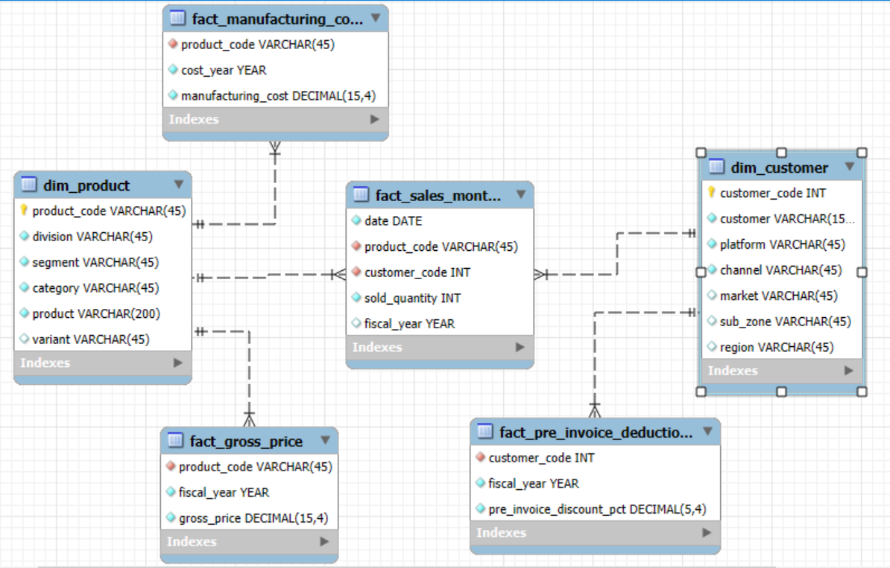

# Ad-Hoc-Insights

SQL Project

# Project Overview
AtliQ Hardwares is a prominent Indian computer hardware brand with a global footprint. Known for its innovation and product quality, AtliQ offers a wide range of devices, including personal computers, keyboards, mice, and printers. As the company grows internationally, it continues to bring advanced technology into homes and businesses worldwide.

# Table of contents:

- [Problem Statment](#Probelm_statement)
- [Objectives](#objectives)
- [Tools used](#Tools_Used)
- [DataSet](#Dataset)
- [Data Model](#Data_Model)
- [Ad Hoc Request](#Ad_Hoc_Request)
- [SQL Queries](#SQL_Queries)
- [Query Output & Insights](#Query_Output_&_Insights)
- [Recommendations](#Recommendations)

# Project Presentation

Check Out Here - [Project Presentation](https://github.com/Ritikmishra8/Ad-Hoc-Insights/blob/main/Presentation-Ad-Hoc-Insights.pdf)

# Problem Statement
 
● The AtliQ management team currently lacks the ability to quickly make data-driven decisions due to insufficient insights from available data.

● To solve this challenge and grow the analytics capability, AtliQ Hardwares is seeking to recruit junior data analysts with both strong technical and communication skills.

● A structured SQL challenge has been rolled out to evaluate candidates on:

- Problem-solving with SQL

- Business understanding

- Clarity in presenting actionable insights

● Hiring decisions will be influenced by performance in this challenge.

# Objectives

● Deliver clear and accurate insights for 10 key business questions.

● Support top-level management with data-driven decision-making.

● Utilize SQL to analyze company data and uncover meaningful patterns.

● Address ad hoc analytical requests from the leadership team.

● Present insights in a concise, easy-to-understand, and actionable format.

# Tools Used

● SQL (My SQL ) for Data Analysis

● Microsoft Power BI for Visuals

# Dataset

Dimension Tables

dim_customers : Table containing detailed customer information.  
dim_products : Table containing detailed product information.

Fact Tables

fact_gross_price : Product-wise gross price by fiscal year.  
fact_manufacturing_cost : Product-wise manufacturing cost by fiscal year.  
fact_pre_invoice_deductions : Product-wise pre-invoice discount by fiscal year.  
fact_sales_monthly : Monthly sales information by product.

# Data Model

# Ad Hoc Requests

Check Out Here [Ad Hoc Requests](https://github.com/Ritikmishra8/Ad-Hoc-Insights/blob/main/ad-hoc-requests.pdf)

# SQL Queries

Check Out Here [SQL Queries](https://github.com/Ritikmishra8/Ad-Hoc-Insights/tree/main/SQL%20Queries)

# Query Output & Insights

1. Provide the list of markets in which customer Atliq Exclusive operates its business in the APAC region.

Insights-   Market Presence (APAC Region)
- AtliQ Exclusive operates in 8 countries within the APAC region.

- India has the highest sales, with nearly 2 million products sold.

- Japan records the lowest, with just 63,000 units sold.

2. What is the percentage of unique product increase in 2021 vs. 2020?
   

Insights- New Product Launches
- Between FY 2020 and 2021, 89 new products were launched.

- This marks a 36.33% increase in unique products, indicating AtliQ's commitment to meeting diverse and growing customer needs across all categories.

3. Provide a report with all the unique product counts for each segment.

Insights- Product Category Distribution

- Top 3 Categories: Notebook, Accessories, Peripherals – together make up 82% of the product base.

- Remaining Categories: Storage, Networking, and Desktop account for 18%.

- This is driven by the high demand for essential computing devices like laptops, keyboards, mice, processors, and graphics cards.

4. Which segment had the most increase in unique products in 2021 vs 2020?
   

Insights- Product Expansion Insights

- Accessories saw the highest growth, with 34 new products, a 50% increase year-over-year.

- Storage and Networking showed minor growth.

- Desktop products saw a significant rise, with 15 new additions, reflecting a 214% increase compared to the previous year.

5. Get the products that have the highest and lowest manufacturing cost
   

 Insights – Product Cost Extremes
 
 - Highest-priced product:
Personal Desktop AQ HOME All-in-1 Gen 2 (Plus 3 variant)

-  Lowest-priced product:
Mouse AQ Master Wired x1 Ms (Standard 1 variant)

6. Generate a report which contains the top 5 customers who received an average high Pre Invoice Discount % for the fiscal year 2021 and in the Indian market.
   

Insights- Cost Extremes in Products

- Highest-priced product: Personal Desktop AQ HOME All-in-1 Gen 2 (Plus 3 variant)

- Lowest-priced product: Mouse AQ Master Wired x1 Ms (Standard 1 variant)

7. Get the complete report of the Gross sales amount for the customer Atliq Exclusive for each month.
   

Insights- Monthly Sales Trends (FY 2020–2021)

- Q3 of 2020 saw the lowest sales due to COVID-19 lockdowns.

- Sales in March–May 2020 dropped below 1 million, far below the average of 12.66 million.

- A strong recovery followed, with November 2021 reaching 32.25 million in sales.

- March and May 2021 saw explosive growth — over 1000% increase compared to 2020.

- Recovery started around September 2020 and peaked in November.

8. In which quarter of 2020, got the maximum total sold quantity?
   

Insights- Quarterly Sales Performance (FY 2020)

- Q1 recorded the highest quantity sold: nearly 7 million units.

- Q3 was the lowest, with 2 million units, due to pandemic impact.

- There was a 5 million unit drop (250% decrease) from Q1 to Q3.

- The company recovered 150% of the lost volume in Q4 post-lockdown.

9. Which channel helped to bring more gross sales in the fiscal year 2021 and the percentage of contribution?
    

Insights- Channel Performance

- Retailer channel (e.g., Croma, Amazon) contributed 73.22% of total sales, nearing $2 billion in gross revenue.

- Direct and distributor channels made up the remaining 26.78%.

- This emphasizes the importance of retailers, and suggests AtliQ can expand further by:

  - Offering tailored discounts

  - Strengthening B2B partnerships

10. Get the Top 3 products in each division that have a high total sold quantity in the fiscal year 2021?

Insights- Top Products by Division
- P&A Division: Top 3 products are mouse variants – high demand.

- N&S Division: Top 3 are pendrive variants – strong market pull.

- PC Division: Dominated by personal laptops.

- Overall: Pendrives lead in units sold, followed by mice. PC products had lower quantities but steady performance within their category.

# Recommendations for Atliq Hardware

- Localize Sales and Marketing Strategies
Tailoring sales and marketing efforts to each country’s specific needs will help AtliQ better align with local customer preferences, strengthen brand presence, and compete more effectively with top industry players.

- Continuously Refresh Product Offerings
Regular updates based on customer demand and market trends will ensure AtliQ remains innovative and relevant in a fast-changing hardware landscape.

- Expand in Underserved Segments
Increasing focus on the Networking, Storage, and Desktop categories will help tap into underpenetrated markets and meet the growing needs of niche customer segments.

- Optimize Costs and Incentivize Loyalty
Reducing manufacturing costs and introducing volume-based discounts or long-term contract pricing can improve margins while boosting customer retention and satisfaction.

- Leverage Seasonal Trends and Strengthen Distributor Networks
Analyzing seasonal sales patterns and improving distributor relationships through CRM tools and profit-sharing models will help maintain stable, long-term growth across regions.

